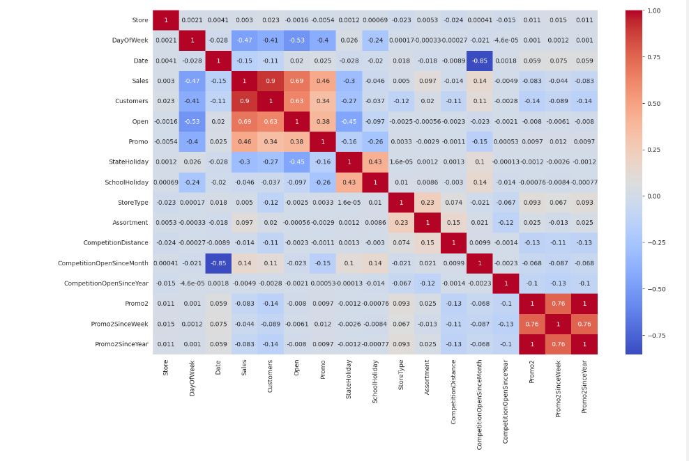
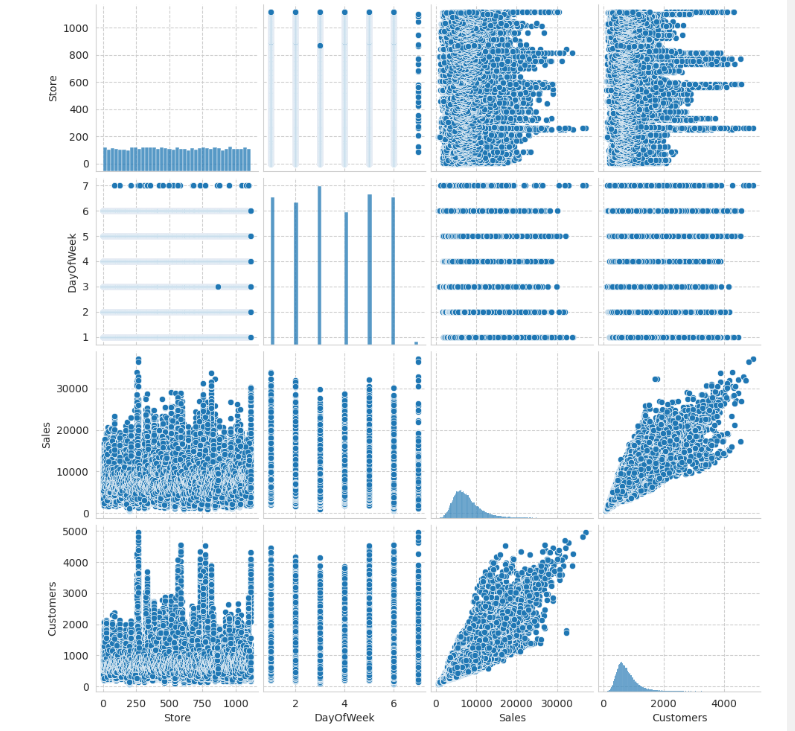

# Store-Sales-Prediction using Machine Learning in Python

---

## Project Overview
This project aims to predict sales for various stores using machine learning and Python. We'll leverage historical sales data and store attributes to identify factors influencing future sales performance. Predictive analytics will be employed to uncover these relationships and build effective models.

## Data Sources
The data for this project originates from Unschool, accessed during my basic data science coursework. The dataset is included within this repository 👉 [store.csv](https://github.com/Thadkapally-Saikiran/Store-Sales-Prediction/blob/main/store.csv),  [test_v2.csv](https://github.com/Thadkapally-Saikiran/Store-Sales-Prediction/blob/main/test_v2.csv), [train_v2.csv](https://github.com/Thadkapally-Saikiran/Store-Sales-Prediction/blob/main/train_v2.csv)

## Problem statement
1. Predict future sales:
   *  The project aims to develop a machine learning model that predicts the sales of different stores based on historical data and various attributes provided in the dataset.
2. Identify key factors:
   * By analyzing the data, the project seeks to discover and understand the factors that significantly influence the number of sales in retail stores. These factors can include customer count, day of the week, promotions, and other relevant attributes.
3. Compare machine learning techniques:
   * The project will implement and compare the performance of normal linear regression techniques with boosting algorithms. The goal is to identify the method that provides the most accurate and reliable sales predictions for the given dataset.
4. Data limitations:
   * The provided data might have limitations, such as the absence of sales data for closed stores or holidays like Easter. These limitations can potentially impact the model's ability to predict sales accurately for scenarios outside the training data.

## Skills/ Concepts demonstrated
The skills or concepts were incorporated in the project:
1. Project Management
   - Problem Statement Definition
   - Experimentation and Analysis
   - Reporting and Visualization
2. Data Analysis Techniques
   - Data Exploration and Cleaning
   - Feature Engineering
   - Data Visualization
3. Machine Learning Techniques
   - Linear Regression
   - Decision tree
   - Random Forest
   - Boosting Algorithms (e.g., XGBoost)
4. Model Building and Evaluation
   - Model Training and Evaluation using Metrics (e.g., MSE, R-squared)

## Visualization:

Correlation Heatmap   
---

Pair-Plot
---

## Recommendations
- Target high-impact features
  * Analyze the correlation matrix to identify features that strongly influence sales (e.g., customers). These features should be prioritized when building your sales prediction models.
- Handle correlated features carefully
  * Correlated features can mislead models. Consider dimensionality reduction to avoid overfitting and improve generalizability.
- Consider additional features not in the correlation matrix
  * Correlation matrices miss relationships between multiple features. Explore additional features beyond the matrix, like weather, competitor activity, or economic factors, to capture a more holistic view for sales prediction.
- Use the correlation matrix to identify potential interactions between features
  * The correlation matrix can reveal hidden influences. Even if features A and B each have weak sales correlations, their strong correlation with each other might suggest an interaction effect on sales. Investigate these potential feature interactions to improve your model's predictive power.
- Be aware of data limitations
  * As the problem statement mentions, the data may have limitations, such as the absence of sales data for closed stores or holidays. The company should be aware of these limitations and how they may impact the accuracy of their models.
    
Here are some additional recommendations:
  * Regularly update your machine learning models with new data. This will help to ensure that your models continue to make accurate predictions over time.
  * Communicate the limitations of your predictions to your clients. It is important to be clear about the fact that no machine learning model can predict the future perfectly.

## Project Files:
* store-sales-prediction.ipynb: Jupyter notebook containing the entire Python code for data analysis, model building, and evaluation.
* train_v2.csv: Training data for store sales prediction.
* test_v2.csv: Testing data for evaluating the model's performance.
* store.csv: Additional information about the stores involved.
* Data Science-Mini Project.pdf: Project documentation and report further explaining the methodology and results.

## References
1. [Machine Learning Algorithms](https://www.kaggle.com/code/marcovasquez/top-machine-learning-algorithms-beginner)
2. [Python Docs](https://docs.python.org/3/tutorial/)
3. [Pandas](https://pandas.pydata.org/docs/)
4. [Matplotlib](https://matplotlib.org/stable/users/getting_started/)
5. [Seaborn](https://seaborn.pydata.org/tutorial/introduction.html)
6. [scikit-learn](https://scikit-learn.org/stable/getting_started.html)

😄

💻
  
  
